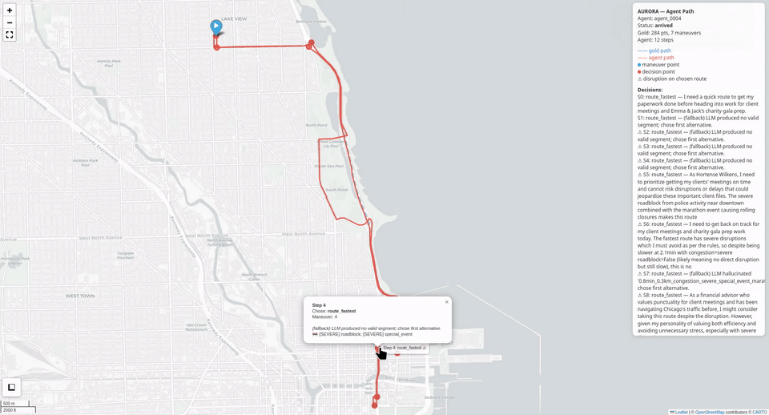
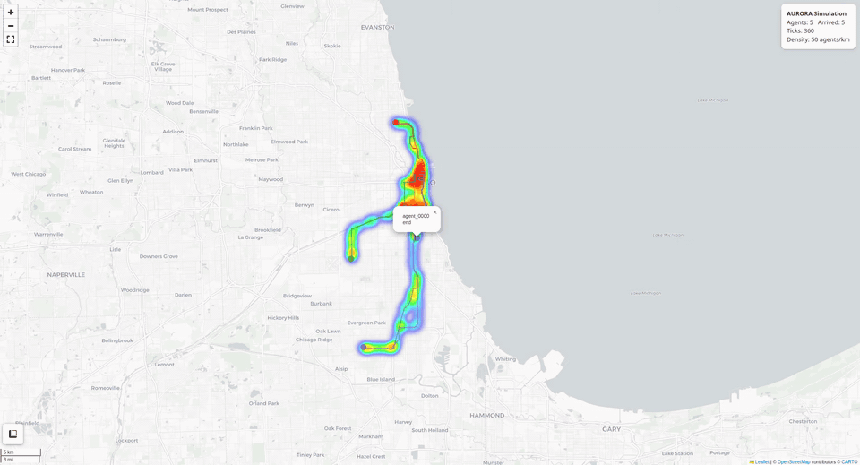

<h1 align="center">AURORA</h1>
<p align="center"><strong>A</strong>utonomous <strong>U</strong>rban <strong>R</strong>easoning and <strong>O</strong>ptimized <strong>R</strong>outing <strong>A</strong>daptation</p>

<p align="center">
  Agentic AI framework for simulating individual travel decision-making<br>
  under transportation network disruptions.
</p>

---

## **Overview**

AURORA generates agents from census microdata (PUMS), each with a unique sociodemographic profile, daily activity schedule, and autonomous route-choice behavior driven by a **LangGraph state machine**. Agents navigate a **Valhalla** road network, adapt to disruptions, and influence each other through a multi-level traffic congestion feedback system.

---

## **Reproducibility: Agent Biographies**

Every agent gets an **LLM-generated biography** at simulation startup, saved for reproducibility:

```bash
output/bios.json   # One bio per agent, generated by Ollama
```

The biography is a 3-5 sentence first-person narrative injected into the LangGraph system prompt, it's what the LLM "knows" about the agent when making route decisions:

```json
{
  "chicago_0001": "I'm a 34-year-old software developer living in the Loop. I own a car but prefer taking the L when possible. I'm comfortable with some risk on the road to save time, especially during rush hour. I work in the West Loop tech hub from 9 to 5.",
  "chicago_0002": "I'm a 62-year-old teacher from Lincoln Park. I don't own a vehicle and rely on the CTA bus for my daily commute. I prefer familiar, predictable routes and avoid construction zones. I need to be at school by 7:45 AM."
}
```

**Key rules**:
- Bios are **always** generated by the LLM (`data/bio.py` raises if LLM unavailable)
- Bios are saved **immediately** at startup (`output/bios.json`), before simulation begins
- The bio becomes the `profile_text` passed to the LangGraph journey cycle (replacing the raw `profile.to_text()`)
- The bio is also included in `simulation.json` under each agent's record

---

## **Output: Interactive Traffic Map**

After a tick-based simulation, AURORA generates an **interactive HTML traffic map** (`output/traffic_map.html`):

- **Agent trails** following actual road shapes (from the chosen Valhalla route polyline, not interpolated tick positions)
- **Start/end markers** for every agent's journey
- **Heatmap** of agent density across the network
- **Popup details** with step counts and route information
- **Fullscreen + measurement controls**

Open it in any browser, no server needed.

### Single Agent Path Comparison
Gold path (dashed blue) vs the actual route chosen by the agent (red) under active disruptions and congestion.



### Traffic Heatmap
Multi-agent traffic concentration across the network; agents cluster on shared corridors, creating congestion hot spots.



```
output/
├── bios.json             # LLM-generated agent biographies (saved at startup)
├── simulation.json       # Full tick-by-tick agent decisions & paths
├── ticks.log             # Tick-level JSON log (position, status, schedule)
├── traffic_map.html      # Interactive map with all agent trails
├── path_agent_*.html     # Per-agent gold-vs-actual route comparison
└── ticks.csv             # Tick-level CSV for external analysis
```

---

## **Quick Start**

```bash
# Install dependencies
pip install -r requirements.txt

# Preview generated agents (no services required)
python3 main.py --list-agents -n 5

# Run tick-based simulation with traffic map
python3 main.py -n 5 --tick-mode --map

# Custom config
python3 main.py -c my_config.yaml --map
```

### CLI Options

| Flag | Description |
|------|-------------|
| `-n N` | Override population size |
| `--tick-mode` | Run tick-based multi-agent mode |
| `--map` | Generate interactive traffic map |
| `--output-dir DIR` | Output directory (default: `output`) |
| `--no-record` | Disable tick-by-tick recording |
| `--list-agents` | Show generated agents and exit |
| `-c FILE` | Custom config file |

Bio generation is automatic in `--tick-mode`: bios are saved to `{output_dir}/bios.json` at startup.

---

## **Architecture**

```
                     ┌─────────────────────────────┐
                     │      PUMS Census Data       │
                     │  (or synthetic fallback)    │
                     └──────────┬──────────────────┘
                                ↓
                     ┌─────────────────────────────┐
                     │  Agent Generation Pipeline  │
                     │  PumsRecord → Profile       │
                     │  Profile → Locations        │
                     │  Profile → ActivitySchedule │
                     └──────────┬──────────────────┘
                                ↓
                     ┌─────────────────────────────┐
                     │   SimulationEngine.run()    │
                     │   Tick-based clock loop     │
                     │   (re-plans per trip)       │
                     └──────────┬──────────────────┘
                                ↓
          ┌─────────────────────┼─────────────────────┐
          ↓                     ↓                     ↓
   ┌────────────┐       ┌──────────────┐      ┌───────────┐
   │ Valhalla   │       │  Ollama LLM  │      │ Recorder  │
   │ Routing    │       │  Agent Logic │      │ Tick JSON │
   └────────────┘       └──────────────┘      └───────────┘
          ↓                     ↓                     ↓
   ┌──────────────────────────────────────────────────────┐
   │              Traffic Feedback Loop                   │
   │                                                      │
   │  ┌───────────────────┐   ┌────────────────────────┐  │
   │  │ CongestionTracker │   │    TrafficManager      │  │
   │  │ (zone-based)      │   │  (edge-level)          │  │
   │  │ avoid_locations   │   │  traffic_stream (live) │  │
   │  │                   │   │  CSV/DCT-II (historic) │  │
   │  └───────────────────┘   └────────────────────────┘  │
   └──────────────────────────────────────────────────────┘
```

---

## **The Journey Cycle (LangGraph)**

Each agent traverses a 5-node LangGraph state machine per trip. The graph is executed **fresh on every tick** from the agent's current position, so route decisions reflect the latest disruptions and congestion:

```
 START → disruption_check → query_valhalla → agent_decision → move → check_arrival
                                          ↑                              │
                                          └──────────────────────────────┘
```

| Node | What happens |
|------|--------------|
| **disruption_check** | Filters active disruptions near the agent's position (radius 3km) |
| **query_valhalla** | Calls Valhalla `/route` for up to 5 alternative paths with congestion/disruption avoidance |
| **agent_decision** | LLM evaluates alternatives via direct `/api/generate` with `format: json` output; routes flagged with disruptions are deprioritised; hallucinated or invalid route IDs fall back to the first valid alternative |
| **move** | Records the full chosen route shape (`path_coords`) for road-following map trails; position updated to the last point of the **chosen** route, not the gold-path's maneuver endpoint |
| **check_arrival** | Checks remaining maneuvers → loops to or arrives |

### Maneuver Merging

Gold-path maneuvers shorter than 250m are merged into longer decision segments. This ensures Valhalla alternatives are genuinely diverse (surface streets vs highway, different corridors) instead of near-identical paths for 20m turns.

### Route Choice & Fallback

The LLM receives:

```
Route options for this segment:
  route_fastest: 2.8min 1.0km congestion=severe | DISRUPTIONS: [SEVERE] roadblock
  route_avoid_cz: 2.9min 1.2km congestion=heavy
  route_shortest: 3.5min 0.9km congestion=light
```

If the LLM returns an empty or hallucinated `segment_id` (e.g. `route_slowest_no_disruptions` that doesn't exist in the alternatives list), the system falls back to the first alternative and logs the event.

### Multi-Trip Itineraries

Agents with `ActivitySchedule` trips (HOME→WORK, WORK→HOME, HOME→DISCRETIONARY, etc.) are supported via a `completed_journeys` list and `is_done` flag. After each arrival the next trip's gold path is generated on-the-fly.

---

## **Traffic Feedback System**

Three complementary layers:

### 1. Zone-Based Congestion

```
Tick N:  ✓ Collect all agent positions
         ✓ CongestionTracker clusters by grid proximity
         ✓ Produces congestion zones (lat, lon, radius, severity)
         ↓
Tick N+1: Each agent queries Valhalla WITH congestion zones as avoid_locations
         → Valhalla routes around congested areas
```

Congestion zones are also passed to the LLM prompt, so agents make informed decisions.

### 2. Edge-Level Live Traffic

```
Tick N:  ✓ Each agent queries Valhalla → route edges extracted
         ✓ TrafficManager records which edges each agent occupies
         ↓
Tick N+1: ✓ TrafficManager computes reduced speeds (density / jam_density)
          ✓ Builds base64 TrafficTile protobuf (traffic_stream)
          ✓ Passed to Valhalla /route → edge costs increase on congested edges
          → Agents naturally avoid crowded roads
```

### 3. Historical CSV/DCT-II Export

Traffic data can be exported as Valhalla-compatible historical traffic files:

- **DCT-II compression**: Pure-Python implementation matching Valhalla's `predictedspeeds.h` (2016 speed buckets → 200 int16 coefficients, big-endian base64)
- **Tile hierarchy**: CSVs written in Valhalla's `level/groups/cifre.csv` format
- **Loading**: `valhalla_add_predicted_traffic` via Docker exec or native command

---

## **Tick-by-Tick Recorder**

Every simulation tick is recorded:

```json
{
  "summary": { "n_agents": 5, "n_ticks": 288, "n_arrived": 5 },
  "agents": {
    "chicago_0001": {
      "profile": { "age": 34, "occupation": "Software Developer", ... },
      "journey": {
        "status": "arrived",
        "step_count": 7,
        "steps": [
          {
            "index": 0,
            "from": [41.8138, -87.6261],
            "to": [41.8799, -87.6254],
            "segment": "route_fastest",
            "reasoning": "...",
            "path_coords": [[41.8138, -87.6261], ...],
            "disruptions_on_route": []
          }
        ]
      }
    }
  },
  "ticks": [
    {
      "tick": 0,
      "timestamp": "2019-07-17T07:00:00",
      "agents": {
        "chicago_0001": {
          "position": [41.88, -87.63],
          "is_traveling": false,
          "schedule_status": { "type": "home" }
        }
      }
    }
  ]
}
```

---

## **Data Pipeline**

```
PUMS CSV → PumsRecord → SociodemographicProfile (age, sex, income, occupation, etc.)
                              ↓
                        Location assignment (home by PUMA, work by occupation)
                              ↓
                        ActivitySchedule (time-bounded slots: home, commute, work, lunch)
                              ↓
                        LLM-generated Biography   ← MANDATORY, saved to output/bios.json
                              ↓
                        Injected into LangGraph as profile_text
```

Agents without WORK or SCHOOL in their itinerary (only DISCRETIONARY) are automatically assigned a Sales/Office work location from their discretionary stop so that `ActivitySchedule.from_profile` generates valid trips.

### PUMS Data Format

| Column | Description | Example |
|--------|-------------|---------|
| `AGEP` | Age | `34` |
| `SEX` | Sex | `1` |
| `RAC1P` | Race code | `1` |
| `PINCP` | Total income | `85000` |
| `OCCP` | Occupation code | `1020` |
| `PWGTP` | Person weight | `85.5` |
| `PUMA` | Public Use Microdata Area | `3501` |

Filtered to Chicago PUMAs 3501–3510. Synthetic generation when no CSV provided.

---

## **Disruption Scenarios**

JSON-driven disruption injection with ISO datetime ranges. Disruptions are defined in `data/disruptions.json` and remain active for their datetime window; no engine-level logic generates them automatically.

```json
[
  {
    "type": "roadblock",
    "severity": "severe",
    "lat": 41.8760,
    "lon": -87.6300,
    "road": "I-90/94 Dan Ryan",
    "description": "Police activity blocking all southbound lanes",
    "radius_meters": 800,
    "start_datetime": "2019-07-17T07:30:00",
    "end_datetime": "2019-07-17T09:00:00",
    "affects_auto": true,
    "affects_transit": false
  }
]
```

8 disruption types: `roadblock`, `traffic_congestion`, `transit_disruption`, `flooding`, `special_event`, `accident`, `construction`, `weather`.

Disruptions affect agent decisions in two ways:
1. **Valhalla routing**: `affects_auto: true` entries influence Valhalla's edge costs when passed via `avoid_locations`
2. **LLM prompt**: every route segment lists its `disruptions_on_route` — disrupting a gold-path segment gives the LLM incentive to choose an alternative

Strategically placed disruptions along major route corridors (e.g. LaSalle St entry, Lake Shore Dr on-ramp, Lake Shore Dr at Balbo Ave) force agents to consider surface-street alternatives.

---

## **Configuration**

Everything lives in `config.yaml`:

| Section | Key | Default |
|---------|-----|---------|
| `valhalla` | `host`, `port`, `timeout` | `localhost:8002`, 30s |
| `llm` | `model`, `temperature` | `llama3.2`, 0.5 |
| `data` | `population_size`, `agent_prefix` | 50, `chicago` |
| `simulation.clock` | `tick_duration_minutes`, `max_ticks` | 5, 288 |
| `traffic` | `jam_density_per_km` | 50.0 |
| `output` | `dir`, `map_zoom`, `center` | `output`, 12, Chicago |

---

## **External Dependencies**

| Service | Purpose | Default |
|---------|---------|---------|
| **Valhalla** | Routing engine (car, bike, pedestrian) | `http://localhost:8002` |
| **Ollama** | Local LLM for agent decisions | `http://localhost:11434` |

```bash
# Start Valhalla (Docker)
docker compose up -d

# Start Ollama
ollama pull llama3.2 && ollama serve
```

Any Ollama model can be used; the LLM caller calls `/api/generate` with `format: json` to constrain output to valid JSON. Models with strong instruction-following (qwen3.5, llama3, mistral) work best.

When Valhalla is unavailable, synthetic fallback routes are generated. When Ollama is unavailable, tests use `FakeLLM`.

---

## **Project Structure**

```
├── agentic/                  LangGraph agentic framework
│   ├── core/models.py        Location, SociodemographicProfile, ActivityPreference
│   └── journey/
│       ├── gold_path.py      Optimal reference route generator
│       └── graph.py          LangGraph state machine (5-node cycle + maneuver merging)
├── routing/                  Valhalla integration
│   ├── engine.py             HTTP client for /route API
│   ├── dct.py                DCT-II compressor (Valhalla predictedspeeds.h)
│   ├── traffic_csv.py        Traffic CSV tile hierarchy builder
│   └── traffic_stream.py     Live TrafficTile protobuf builder
├── disruption/               Disruption injection
│   ├── scenarios.py          Dataclass + templates (8 types)
│   └── loader.py             JSON file loader + validator
├── simulation/               Core simulation
│   ├── engine.py             Tick-based orchestrator (multi-trip, gold-path disruptions)
│   ├── clock.py              SimulationClock
│   ├── activity.py           ActivitySchedule with time-bounded slots
│   ├── traffic.py            CongestionTracker + TrafficManager
│   ├── recorder.py           Tick-by-tick recording (JSON)
│   └── config.py             Typed YAML config loader
├── visualization/            Output maps
│   └── traffic_map.py        Folium interactive map with road-following agent trails
├── data/                     Census data pipeline
│   ├── pums.py               PUMS CSV loader + synthetic fallback
│   ├── synthesizer.py        Records → agent profiles + coordinates
│   ├── bio.py                LLM-powered biography generator
│   └── disruptions.json      Disruption scenario definitions
├── tests/test_all.py         75 tests (unit + integration, no external services)
├── main.py                   CLI entry point
├── config.yaml               All tunable parameters
└── requirements.txt          Python dependencies
```

---

## **Key Design Decisions**

- **LangGraph** over Langroid for cyclic state graphs with conditional edges
- **Valhalla direct HTTP**, POST to `/route` with `polyline6`, no client wrappers
- **PUMS-driven agents**, census microdata, not hardcoded profiles
- **Profile-driven decisions**, risk tolerance, mobility, vehicle access, not utility maximization
- **Tick-based synchronization**, global `SimulationClock` advances all agents per tick
- **On-the-fly re-planning**: the full journey graph is invoked every tick from the agent's current position, so route choices reflect live disruptions and congestion
- **LLM via `/api/generate` with `format: json`**: avoids tool-binding issues; the model outputs JSON directly, parsed for segment choice
- **Maneuver merging**: consecutive gold-path maneuvers < 250m are merged to give the LLM meaningful alternative routes
- **Position tracking**: the agent's position is updated from the chosen route's shape endpoint, not the gold-path maneuver endpoint, preventing visual gaps
- **Fallback for invalid choices**: hallucinated / empty route IDs are caught and replaced with the first valid alternative
- **Two-level congestion**, zone-based (avoid_locations) + edge-level (traffic_stream protobuf)
- **DCT-II from Valhalla C++**, exact match of `predictedspeeds.h` constants (`k1OverSqrt2`, `kSpeedNormalization`)
- **Tick recording**, every position, decision, and edge saved for replay and analysis
- **Folium maps**, interactive HTML output, no server needed, works offline

---

## **Module API**

| Module | Key Classes/Functions |
|--------|-----------------------|
| `routing.engine` | `ValhallaEngine`, `Route`, `RoutePoint`, `decode_polyline6()` |
| `routing.dct` | `compress_speed_buckets()`, `decompress_speed_bucket()`, `encode_compressed_speeds()` |
| `routing.traffic_csv` | `TrafficCsvWriter`, `graph_id_to_string()`, `tile_csv_path()` |
| `routing.traffic_stream` | `build_traffic_stream()` |
| `disruption.scenarios` | `Disruption`, `DisruptionType`, `DisruptionInjector` |
| `disruption.loader` | `load_disruptions()`, `load_disruptions_from_paths()` |
| `agentic.journey.graph` | `build_graph()`, `run()`, `JourneyState`, `_merge_short_maneuvers()` |
| `agentic.journey.gold_path` | `GoldPathGenerator`, `GoldPath` |
| `simulation.clock` | `SimulationClock` |
| `simulation.activity` | `ActivitySchedule`, `ActivitySlot`, `Trip` |
| `simulation.traffic` | `CongestionTracker` (zone clustering) + `TrafficManager` (edge speeds, stream, CSV) |
| `simulation.recorder` | `SimulationRecorder` (tick recording, JSON export) |
| `simulation.engine` | `SimulationEngine`, `SimResult`, `AgentState` |
| `visualization.traffic_map` | `generate_traffic_map()` (folium HTML map) |
| `simulation.config` | `Config`, `load_config()` |
| `data.pums` | `PumsRecord`, `load_or_generate()` |
| `data.synthesizer` | `synthesize_agents()` |
| `data.bio` | `generate_bio()` (LLM mandatory raises if unavailable) |

---

<p align="center">
  <sub>Built with LangGraph · Valhalla · Ollama · Folium · PUMS</sub>
</p>
